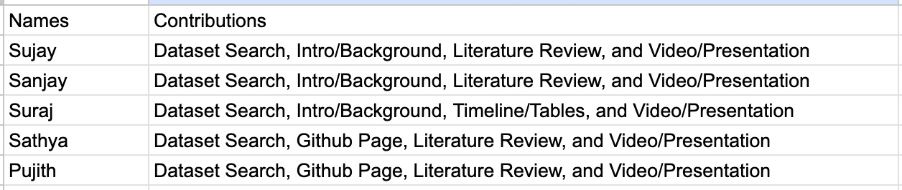

# CS 7641 Project

## Project Proposal

### Introduction

Professional tennis has seen numerous historic matches, tremendous athletes, and game-changing strategies over the past decade. This project aims to dive deep into this by examining a rich dataset encompassing a plethora of tennis matches. This dataset includes comprehensive details like match outcomes, betting odds, set and game outcomes, player statistics, court type, date, etc.

### Literature Review

Kovalchik delved into the realm of tennis predictions by comparing 30 different models to predict the outcomes of men's professional tennis matches over eight seasons. This comprehensive study took into account a player's past performance, player rankings, and even surface-specific performance, identifying that surface-adjusted Elo ratings were the most accurate predictors of match outcomes (Dixon, 1997).

Though not strictly on tennis, Dixon and Coles' study on association football offers valuable insights on how betting odds can play a significant role in predicting match outcomes. They developed a model for predicting match results based on a Poisson distribution, which could be applied or adjusted for tennis given the similarities in the prediction realm (Kovalchik, 2016).

Sipko tackled the NBA but introduced methods that are transferable to tennis prediction. He utilized the betting market with ranking methods, highlighting that betting odds indeed encompass significant predictive power, a testament to the efficiency of the broader betting market. This supports the idea of integrating betting odds into tennis match predictions for higher accuracy (Sipko, 2014).

Several studies have attempted to predict tennis match outcomes or understand player performances, but with the influx of data, especially related to betting odds and in-depth player stats, there’s a new opportunity to extract meaningful insights.

### Problem Definition

The primary objective of this project is to predict tennis game, set, and match outcomes based on a series of parameters. The vast dataset provides a great foundation to seek patterns that might not be obvious at first glance. Additionally, by integrating betting odds, there's potential to evaluate the market's accuracy in forecasting match results. We could also dive into how well a player may progress throughout a tournament, and predict their results before the tournament starts.

### Methods

The project will employ a variety of machine learning algorithms, primarily starting with logistic regression and decision trees. Given the intricacy of the dataset, ensemble methods like random forests or gradient boosting might be employed later. We intend to leverage libraries such as scikit-learn. Our dataset is from Kaggle, which is a free platform that has numerous, large datasets of various topics.

### Potential Results and Discussions

Metrics such as accuracy, precision, recall, and the F1 score will be used to gauge the model's efficiency. We can anticipate a fairly high success rate on the prediction based on initial exploratory data analysis. However, these figures can change for the better, as we delve deeper and refine our models through testing.

## Data Visualizations and Explanations

This figure shows the correlation between win rate and number of games played. Each dot (player) represents their win rate based on how many games they played. With the given data, we found no correlation between the factors, meaning more games played doesn't affect how likely a player is to win or lose.

The pie chart shows the average number of aces of all the data for each court surface played. We can see that clay has the least aces, and grass has the most aces (we are not including carpet because it is not that popular). This can tell us a lot about the data and can help with our overall goal of predicting matches. More aces means that the service games won for that player is probably a lot more frequent and easier compared to less aces. So, this could affect the number of games played for example between different court surfaces. These findings can be very important when trying to predict how many games player will play at different matches.

The word cloud represents the players with the most victories from all the data. The larger the name looks on the cloud, the more wins they have. This is obviously helpful in figuring out who is more likely to win on any given day, especially since Tennis is an individual sport and a consistent track record of victories is a good indiciation of a future win.

### Timeline

Gantt Chart:

### Contribution Chart

### Checkpoints

Midterm Report (9 weeks into the semester):

- Initial Model Building & Testing:
- Implement the chosen machine learning models on a subset of the data.
- Run initial tests to ascertain the accuracy and efficiency of these models.
  
Final Report (End of semester):

- Model Finalization & Documentation:
- Complete any remaining testing and finalize the models.
- Thoroughly document the methods employed

### Datasets
[Dataset 1](https://www.kaggle.com/datasets/ehallmar/a-large-tennis-dataset-for-atp-and-itf-betting)

[Dataset 2](https://www.kaggle.com/datasets/edoardoba/atp-tennis-data)

### Bibliography

Dixon, M. J., & Coles, S. G. (1997). "Modelling association football scores and inefficiencies in the football betting market." Applied statistics, 46(2), 265-280.

Kovalchik, S. A. (2016). "Searching for the GOAT of tennis win prediction." Journal of Quantitative Analysis in Sports, 12(3), 127-138.

Sipko, T. (2014). "Predicting the outcomes of NBA basketball games." arXiv preprint arXiv:1411.1443.
