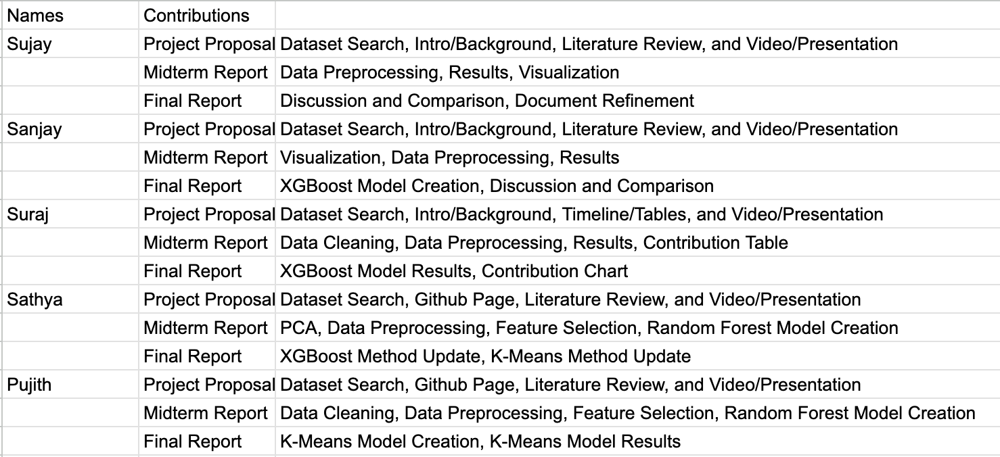

# CS 7641 Project

### Introduction

Professional tennis has seen numerous historic matches, tremendous athletes, and game-changing strategies over the past decade. This project aims to dive deep into this by examining a rich dataset encompassing a plethora of tennis matches. This dataset includes comprehensive details like match outcomes, betting odds, set and game outcomes, player statistics, court type, date, etc.

### Literature Review

Kovalchik delved into the realm of tennis predictions by comparing 30 different models to predict the outcomes of men's professional tennis matches over eight seasons. This comprehensive study took into account a player's past performance, player rankings, and even surface-specific performance, identifying that surface-adjusted Elo ratings were the most accurate predictors of match outcomes (Dixon, 1997).

Though not strictly on tennis, Dixon and Coles' study on association football offers valuable insights on how betting odds can play a significant role in predicting match outcomes. They developed a model for predicting match results based on a Poisson distribution, which could be applied or adjusted for tennis given the similarities in the prediction realm (Kovalchik, 2016).

Sipko tackled the NBA but introduced methods that are transferable to tennis prediction. He utilized the betting market with ranking methods, highlighting that betting odds indeed encompass significant predictive power, a testament to the efficiency of the broader betting market. This supports the idea of integrating betting odds into tennis match predictions for higher accuracy (Sipko, 2014).

Several studies have attempted to predict tennis match outcomes or understand player performances, but with the influx of data, especially related to betting odds and in-depth player stats, there’s a new opportunity to extract meaningful insights.

### Problem Definition
This project aims to harness the power of machine learning to revolutionize the way tennis outcomes are predicted, providing an analytical edge in understanding the nuances of the game. By analyzing a rich dataset that includes player matchups, rankings, tournament specifics, and betting odds, we can uncover patterns that offer deeper insights into player performances and predict tournament trajectories with greater accuracy. This approach not only enhances the understanding of the sport but also offers valuable perspectives for fans, analysts, and betting markets. The primary objective of this project is to predict tennis game, set, and match outcomes based on a series of parameters. The vast dataset provides a great foundation to seek patterns that might not be obvious at first glance. We can use past matchups between players and seed rankings to give us crucial information on predicting the outcome of the match and the spread of the sets as well. Information like tournament location and type of surface can be factors for future games that can be analyzed as either strenghts or weaknesses for certain players. Additionally, by integrating betting odds, there's potential to evaluate the market's accuracy in forecasting match results. We could also dive into how well a player may progress throughout a tournament, and predict their results before the tournament starts.

### Methods

The project will employ a variety of machine learning algorithms, primarily starting with logistic regression and decision trees. Given the intricacy of the dataset, ensemble methods like random forests or gradient boosting might be employed later. We intend to leverage libraries such as scikit-learn. Our dataset is from Kaggle, which is a free platform that has numerous, large datasets of various topics.

#### Data Preprocessing

This program performs several preprocessing steps on a large dataset contained in a CSV file, all_matches.csv. The preprocessing includes filtering, cleaning, and transforming the data to make it suitable for further analysis and modeling. Here are the steps involved:

Reading the CSV File: The program begins by importing necessary libraries and then reading the CSV file into a pandas DataFrame. This is a standard procedure for handling structured data in Python.

Filtering by Date: The DataFrame is filtered to include only the records where the start date falls between 2010 and 2018, as that is when the betting data starts, and more of the columns are filled out. This is achieved by extracting the year from the start_date column and using conditional logic.

Handling Missing Values in a Target Variable: The program drops rows where the player_victory column (which likely indicates the outcome of a match) is missing. This step ensures that the target variable for any subsequent analysis or model is complete.

Binary Encoding of a Categorical Variable: The player_victory column is transformed from a categorical variable ('t' or 'f') into a binary format (1 or 0). This is a common practice in preparing data for machine learning models.

Dropping Irrelevant Columns: Several columns deemed irrelevant or mostly null are removed from the DataFrame. This step simplifies the dataset and can improve the performance and accuracy of analytical models by removing noise and unnecessary information.

Handling Rows with Excessive Missing Values: The program removes rows that have a significant number of missing values. The threshold for "significant" is set as half the total number of columns. This step further cleans the dataset.

Imputing Missing Values: The remaining missing values in the dataset are imputed. For categorical columns, the mode (most frequent value) is used to fill missing values. For numeric columns, the mean (average) value is used. This step ensures that the dataset has no missing values, which is important for many types of analyses and models.

Encoding Categorical Variables: By encoding categorical variables and separating the features from the target variable, the data becomes compatible with the requirements of most machine learning algorithms in sklearn. The code iterates over all columns in the DataFrame that are of object type, which usually indicates categorical data. For each of these columns, it performs the following steps:

- A new LabelEncoder object is created and stored in a dictionary (label_encoders). This dictionary maps each column to its corresponding encoder, which is useful for inverse transformations later (converting numeric labels back to categorical labels).

- The fit_transform method of the LabelEncoder is used. This method first fits the encoder to the unique values in the column and then transforms these values into numerical labels. The transformed data replaces the original column values in the DataFrame.

Splitting the DataFrame into Features and Target:

- X: The feature set (X) is created by dropping the player_victory column from the DataFrame. This implies that player_victory is the target variable, and the rest of the columns are features used for prediction.
  
- y: The target variable (y) is set as the player_victory column.

Saving the Processed Data: Finally, the cleaned and processed dataset is saved to a new CSV file, matches_between_2010_2018.csv. This file can be used for further analysis or modeling.

Overall, we have prepared the dataset for analysis by addressing common issues like irrelevant features, missing values, and non-numeric data. This preprocessing is an essential step in data science to ensure the quality and reliability of predictions derived from the data.

### Data Visualizations and Explanations

This figure shows the correlation between win rate and number of games played. Each dot (player) represents their win rate based on how many games they played. With the given data, we found no correlation between the factors, meaning more games played doesn't affect how likely a player is to win or lose.

The pie chart shows the average number of aces of all the data for each court surface played. We can see that clay has the least aces, and grass has the most aces (we are not including carpet because it is not that popular). This can tell us a lot about the data and can help with our overall goal of predicting matches. More aces means that the service games won for that player is probably a lot more frequent and easier compared to less aces. So, this could affect the number of games played for example between different court surfaces. These findings can be very important when trying to predict how many games player will play at different matches.

The word cloud represents the players with the most victories from all the data. The larger the name looks on the cloud, the more wins they have. This is obviously helpful in figuring out who is more likely to win on any given day, especially since Tennis is an individual sport and a consistent track record of victories is a good indiciation of a future win.

#### Random Forest Classifier (w/ PCA):
The first method we implemented and tested is a random forest classifier. We used this method for predicting the outcome of a given match between two payers. Random forests are an ensemble learning method that builds multiple decision trees during training and merges them together to get a more accurate and stable prediction. In the context of predicting tennis match outcomes, this ensemble approach can capture complex patterns and relationships within the data, making it effective for handling the intricacies of the sport, such as match conditions and historical performance.

Before employing the random forest classifier, Principal Component Analysis (PCA) was used. PCA is a dimensionality reduction technique which works by transforming the original features into a new set of uncorrelated features, called principal components, ordered by their importance in explaining the variance in the data. The main objective of PCA is to reduce the dimensionality of the data while retaining as much of the original variability as possible. In our model, a PCA instance is made with n_components=0.95, indicating that PCA should retain enough components to explain 95% of the variance in the data. This allows for reducing dimensionality, while retaining a significant portion of the original information.

The code first performs a train-test split on the transformed data, dividing the dataset into training and testing sets to allow evaluation of the model's performance on unseen data. Then, the RandomForestClassifier from scikit-learn is employed with 100 decision trees (n_estimators=100) and a fixed random seed for reproducibility (random_state=42). The number of decision trees is a hyperparameter which typically increases accuracy as it is increased while also increasing computational complexity. We tested different quantities before settling on the choice of 100 decision trees, which seemed to strike a balance between model complexity and computational efficiency. Additionally, setting a fixed random seed, in this case, 42, ensures reproducibility in the model training process. When the random forest algorithm involves randomness, such as in the random selection of subsets of data for training each tree, setting a seed allows for the same random process to be replicated. This is important for consistency, as running the same code with the same seed should produce the same results. The model fitting process is straightforward, involving the training of multiple decision trees on different subsets of the training data, and then evaluating the performance on the testing data.

Although our model performed very well across the evaluation metrics, there are potential downsides to using a random forest model that are worth mentioning. Random forests can be prone to overfitting, especially if the number of trees is too high or if the model is too complex. Fine-tuning hyperparameters, such as the maximum depth of the trees and the number of decision trees, could be explored to mitigate overfitting. The overall performance and efficiency of the model depend on various factors, including the quality of the data, the chosen features, and the hyperparameter settings. Since we used a high quality dataset which spans many years and used PCA for dimensinality reduction, the model we created performed well.

### Results

As stated earlier, we chose to use a random forest classifier on our problem. We chose this model because it is great at handling non-linear data (our dataset has a lot of that), handling missing values, and reducing overfitting. After running our model on the dataset to predict tennis match outcomes, we tested our model with various ML metrics.

Overall, our model's performance metrics indicate extremely high accuracy and effectiveness in predicting tennis match outcomes. Here is a breakdown of each metric:

**Accuracy (0.9971):** This measures the proportion of total predictions (wins and losses) that were correct. An accuracy of 0.9971 means that 99.71% of our predictions were accurate, which is exceptionally high.

**Precision (0.9976):** Precision evaluates how many of the predicted wins were actual wins. A precision of 0.9976 implies that when our model predicts a player will win, it is correct 99.76% of the time.

**Recall (0.9965):** Recall assesses how many actual wins were correctly identified by the model. A recall of 0.9965 means that our model successfully identified 99.65% of all the actual wins.

The Precision-Recall curve shows the trade-off between precision and recall for different threshold. A high area under the curve represents both high recall and high precision, where high precision relates to a low false positive rate, and high recall relates to a low false negative rate.

**F1 Score (0.9971):** The F1 score is the harmonic mean of precision and recall, providing a balance between them. An F1 score of 0.9971 is near perfect, indicating a strong balance between precision and recall in our model.

**ROC-AUC Score (0.9998):** This score measures the ability of our model to distinguish between the classes (win and loss). A score of 0.9998 is almost perfect, indicating that our model does an exceptional job at distinguishing wins from losses.

The Receiver Operating Characteristic (ROC) curve is a graphical plot that illustrates the diagnostic ability of a binary classifier system as its discrimination threshold is varied. The curve is created by plotting the true positive rate (TPR) against the false positive rate (FPR) at various threshold settings.
The area under the ROC curve (AUC) is a measure of the model's ability to distinguish between the classes. An AUC of 0.5 suggests no discrimination (i.e., random chance), while an AUC of 1.0 indicates perfect discrimination.

**Confusion Matrix:**

    - True Negatives (TN): 21015 (correctly predicted losses)
    - False Positives (FP): 51 (incorrectly predicted as wins)
    - False Negatives (FN): 73 (incorrectly predicted as losses)
    - True Positives (TP): 21049 (correctly predicted wins)
   This matrix provides a detailed breakdown of our predictions, showing an extremely high number of correct predictions and very few errors.

**Log Loss (0.02):** This measures the uncertainty of our predictions, with lower values being better. A log loss of 0.02 indicates that our model is highly confident and accurate in its predictions.

**Feature Importance:**

Feature importance gives us a score for each feature of our data, the higher the score, the more important or relevant is the feature towards our output variable. Feature importance is an inbuilt class that comes with Tree Based Classifiers, and we can use Random Forest Classifier for extracting the top features for our dataset.

Higher Bar: Indicates that the feature is more important for the model when making predictions.
Lower Bar: Indicates that the feature is less important.

In the bar chart, each bar represents a feature in the dataset, and the length of the bar corresponds to the importance score. This helps in understanding which features have the most impact on the predictions made by the model.

In this case, we see that a lot of the features that we left in aren't really useful in our classification task. Instead, a small number of features are being used the most in our model. For instance, sets_won and games_won are the two most important predictors for this problem. This makes sense because if a player wins a lost of sets/games, that typically means they will win the next one.

This also suggests that we should perform feature reduction on this dataset to get a simpler model which reduces the features that are used in the predictions.

#### Interpretation and Next Steps
- The high accuracy, precision, recall, and F1 score suggest our model is extremely effective in predicting tennis match outcomes.
- The near-perfect ROC-AUC score implies excellent discriminative ability.
- The confusion matrix confirms the high reliability of our model, with very few false positives and negatives.
- The low log loss reflects the model's confidence in its predictions.
- One thing to note is that our model performed extremely well. Sports outcomes are generally influenced by many unpredictable factors, making highly accurate predictions challenging. Our model achieves near-perfect accuracy, and this could suggest that the problem as modeled may not fully capture the inherent complexities and uncertainties of real-world tennis matches, or our problem is too simple.
    - Thus, moving forward (for the final report) we can either try to find a dataset that models the complexities of the sport better, or we can shift to a more difficult problem in the context of our dataset.
        - Some harder problems we can try to solve for next time are: predicting number of sets each game goes to, predicting how many games/set each player wins/loses in each match, number of break points and number of aces, helping analyze which betting odds are inaccurate/accurate, number of victories based off of tournament/court surface.
    - Another possibility for such high accuracy could be data leakage, where information from the test set (or future information not available at prediction time) inadvertently influences the model during training. This can happen if the dataset includes features that would not be available in a real predictive scenario.
    - The dataset might also be too homogeneous or lack variability, leading the model to easily pick up patterns that might not generalize well to real-world, more diverse data. Looking through our model and dataset, we think this may be the case. Thus, as discussed above, we might want to explore a different problem in the future milestone.

### Timeline

Gantt Chart:

### Contribution Chart

### Checkpoints
  
Final Report (End of semester):

- Model Finalization & Documentation:
- Complete any remaining testing and finalize the models.
- Thoroughly document the methods employed.
- Add functionality to predict more than just games like spread of sets and betting odds.

### Datasets
[Dataset 1](https://www.kaggle.com/datasets/ehallmar/a-large-tennis-dataset-for-atp-and-itf-betting)

This dataset has many files and we are primarily focusing on using the all_matches.csv that has data regarding games dating all the way back to 1993. There is key information about each game like date, player name, rankings, and specific stats pertaining to the game like breakpoints won and serve rating. There is also data relating to specific tournaments that can be used to analyze players perfomances in certain tournaments or countries to make our model more accurate. Finally, there are data files relating to betting moneylines and spreads that can be used in consideration with out regular model results to come to different conclusions on player victories and spreads.
### Bibliography

Dixon, M. J., & Coles, S. G. (1997). "Modelling association football scores and inefficiencies in the football betting market." Applied statistics, 46(2), 265-280.

Kovalchik, S. A. (2016). "Searching for the GOAT of tennis win prediction." Journal of Quantitative Analysis in Sports, 12(3), 127-138.

Sipko, T. (2014). "Predicting the outcomes of NBA basketball games." arXiv preprint arXiv:1411.1443.
