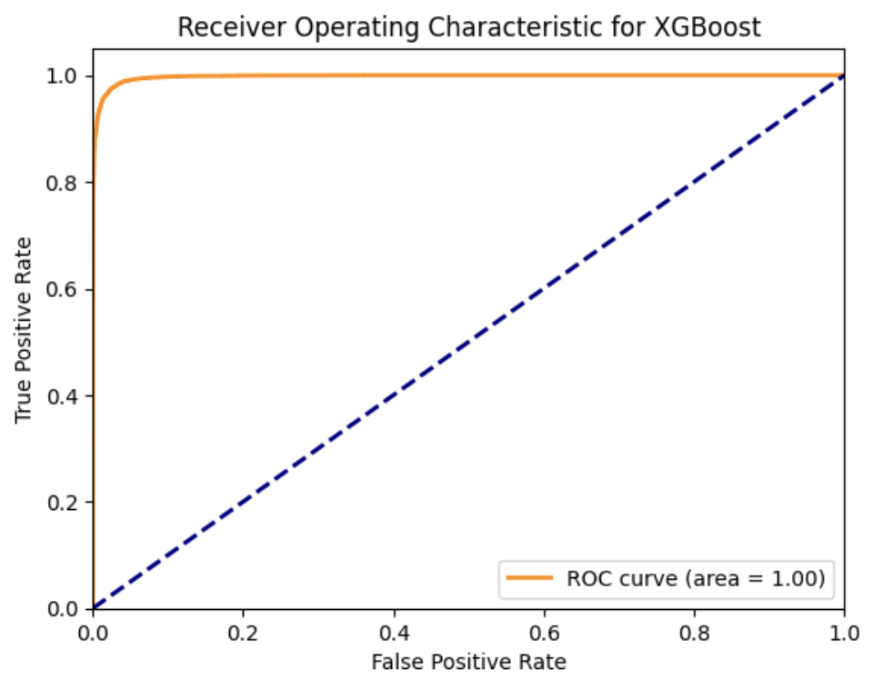
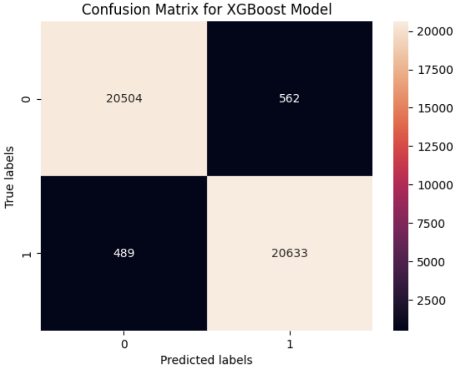
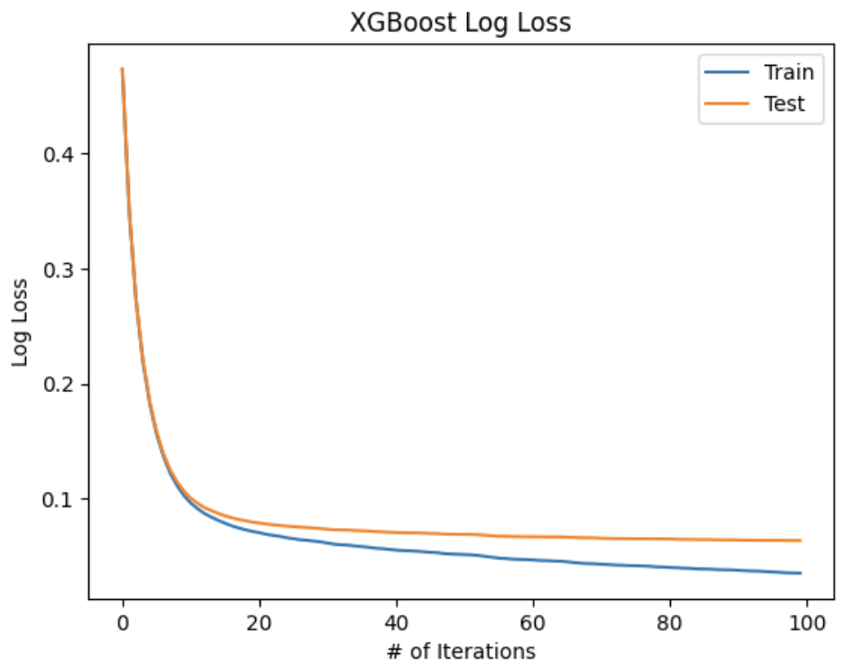
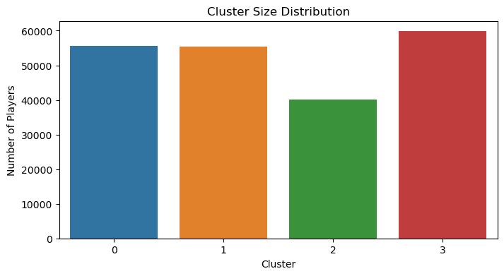

# CS 7641 Project

## Introduction

Professional tennis has seen numerous historic matches, tremendous athletes, and game-changing strategies over the past decade. This project aims to dive deep into this by examining a rich dataset encompassing a plethora of tennis matches. This dataset includes comprehensive details like match outcomes, set and game outcomes, player statistics, court type, date, etc.

## Literature Review

Kovalchik delved into the realm of tennis predictions by comparing 30 different models to predict the outcomes of men's professional tennis matches over eight seasons. This comprehensive study took into account a player's past performance, player rankings, and even surface-specific performance, identifying that surface-adjusted Elo ratings were the most accurate predictors of match outcomes (Dixon, 1997).

Though not strictly on tennis, Dixon and Coles' study on association football offers valuable insights on how betting odds can play a significant role in predicting match outcomes. They developed a model for predicting match results based on a Poisson distribution, which could be applied or adjusted for tennis given the similarities in the prediction realm (Kovalchik, 2016).

Sipko tackled the NBA but introduced methods that are transferable to tennis prediction. He utilized the betting market with ranking methods, highlighting that betting odds indeed encompass significant predictive power, a testament to the efficiency of the broader betting market. This supports the idea of integrating betting odds into tennis match predictions for higher accuracy (Sipko, 2014).

Several studies have attempted to predict tennis match outcomes or understand player performances, but with the influx of data, especially related to betting odds and in-depth player stats, there’s a new opportunity to extract meaningful insights.

## Problem Definition

This project aims to harness the power of machine learning to revolutionize the way tennis outcomes are predicted, providing an analytical edge in understanding the nuances of the game. By analyzing a rich dataset that includes player matchups, rankings, tournament specifics, we can uncover patterns that offer deeper insights into player performances and predict tournament trajectories with greater accuracy. This approach not only enhances the understanding of the sport but also offers valuable perspectives for fans, analysts, and betting markets. 

The primary objective of this project is to predict tennis game outcomes based on a series of parameters. The vast dataset provides a great foundation to seek patterns that might not be obvious at first glance. We can use past matchups between players and seed rankings to give us crucial information on predicting the outcome of the match and the spread of the sets as well. Information like tournament location and type of surface can be factors for future games that can be analyzed as either strengths or weaknesses for certain players. 

In addition, we aim to use unsupervised learning to cluster players into different groups based on their play style.

## Data Visualizations and Explanations

This figure shows the correlation between win rate and number of games played. Each dot (player) represents their win rate based on how many games they played. With the given data, we found no correlation between the factors, meaning more games played doesn't affect how likely a player is to win or lose.

The pie chart shows the average number of aces of all the data for each court surface played. We can see that clay has the least aces, and grass has the most aces (we are not including carpet because it is not that popular). This can tell us a lot about the data and can help with our overall goal of predicting matches. More aces means that the service games won for that player is probably a lot more frequent and easier compared to less aces. So, this could affect the number of games played for example between different court surfaces. These findings can be very important when trying to predict how many games player will play at different matches.

The word cloud represents the players with the most victories from all the data. The larger the name looks on the cloud, the more wins they have. This is obviously helpful in figuring out who is more likely to win on any given day, especially since Tennis is an individual sport and a consistent track record of victories is a good indiciation of a future win.

## Methods

The project will employ a variety of machine learning algorithms; given the intricacy of the dataset, ensemble methods like random forests and XGBoost are employed. In addition, we use K-means clustering to perform unsupervised learning and cluster our dataset. We intend to leverage libraries such as scikit-learn. Our dataset is from Kaggle, which is a free platform that has numerous, large datasets of various topics.

### Data Preprocessing

This program performs several preprocessing steps on a large dataset contained in a CSV file, all_matches.csv. The preprocessing includes filtering, cleaning, and transforming the data to make it suitable for further analysis and modeling. Here are the steps involved:

Reading the CSV File: The program begins by importing necessary libraries and then reading the CSV file into a pandas DataFrame. This is a standard procedure for handling structured data in Python.

Filtering by Date: The DataFrame is filtered to include only the records where the start date falls between 2010 and 2018, as that is when the betting data starts, and more of the columns are filled out. This is achieved by extracting the year from the start_date column and using conditional logic.

Handling Missing Values in a Target Variable: The program drops rows where the player_victory column (which likely indicates the outcome of a match) is missing. This step ensures that the target variable for any subsequent analysis or model is complete.

Binary Encoding of a Categorical Variable: The player_victory column is transformed from a categorical variable ('t' or 'f') into a binary format (1 or 0). This is a common practice in preparing data for machine learning models.

Dropping Irrelevant Columns: Several columns deemed irrelevant or mostly null are removed from the DataFrame. This step simplifies the dataset and can improve the performance and accuracy of analytical models by removing noise and unnecessary information.

Handling Rows with Excessive Missing Values: The program removes rows that have a significant number of missing values. The threshold for "significant" is set as half the total number of columns. This step further cleans the dataset.

Imputing Missing Values: The remaining missing values in the dataset are imputed. For categorical columns, the mode (most frequent value) is used to fill missing values. For numeric columns, the mean (average) value is used. This step ensures that the dataset has no missing values, which is important for many types of analyses and models.

Encoding Categorical Variables: By encoding categorical variables and separating the features from the target variable, the data becomes compatible with the requirements of most machine learning algorithms in sklearn. The code iterates over all columns in the DataFrame that are of object type, which usually indicates categorical data. For each of these columns, it performs the following steps:

- A new LabelEncoder object is created and stored in a dictionary (label_encoders). This dictionary maps each column to its corresponding encoder, which is useful for inverse transformations later (converting numeric labels back to categorical labels).

- The fit_transform method of the LabelEncoder is used. This method first fits the encoder to the unique values in the column and then transforms these values into numerical labels. The transformed data replaces the original column values in the DataFrame.

Splitting the DataFrame into Features and Target:

- X: The feature set (X) is created by dropping the player_victory column from the DataFrame. This implies that player_victory is the target variable, and the rest of the columns are features used for prediction.
- y: The target variable (y) is set as the player_victory column.

Saving the Processed Data: Finally, the cleaned and processed dataset is saved to a new CSV file, matches_between_2010_2018.csv. This file can be used for further analysis or modeling.

Overall, we have prepared the dataset for analysis by addressing common issues like irrelevant features, missing values, and non-numeric data. This preprocessing is an essential step in data science to ensure the quality and reliability of predictions derived from the data.

### Random Forest Classifier (w/ PCA)

The first method we implemented and tested is a random forest classifier. We used this method for predicting the outcome of a given match between two payers. Random forests are an ensemble learning method that builds multiple decision trees during training and merges them together to get a more accurate and stable prediction. In the context of predicting tennis match outcomes, this ensemble approach can capture complex patterns and relationships within the data, making it effective for handling the intricacies of the sport, such as match conditions and historical performance.

Within our random forest classifier model, we created two sub-models to experiment with the impact of dimensionality reduction on the results. In one of the sub-models, no dimensionality reduction was employed, while in the second, before applying the random forest classifier, Principal Component Analysis (PCA) was used. PCA is a dimensionality reduction technique which works by transforming the original features into a new set of uncorrelated features, called principal components, ordered by their importance in explaining the variance in the data. The main objective of PCA is to reduce the dimensionality of the data while retaining as much of the original variability as possible. In our model, a PCA instance is made with n_components=0.95, indicating that PCA should retain enough components to explain 95% of the variance in the data. This allows for reducing dimensionality, while retaining a significant portion of the original information.

The code first performs a train-test split on the transformed data, dividing the dataset into training and testing sets to allow evaluation of the model's performance on unseen data. Then, the RandomForestClassifier from scikit-learn is employed with 100 decision trees (n_estimators=100) and a fixed random seed for reproducibility (random_state=42). The number of decision trees is a hyperparameter which typically increases accuracy as it is increased while also increasing computational complexity. We tested different quantities before settling on the choice of 100 decision trees, which seemed to strike a balance between model complexity and computational efficiency. Additionally, setting a fixed random seed, in this case, 42, ensures reproducibility in the model training process. When the random forest algorithm involves randomness, such as in the random selection of subsets of data for training each tree, setting a seed allows for the same random process to be replicated. This is important for consistency, as running the same code with the same seed should produce the same results. The model fitting process is straightforward, involving the training of multiple decision trees on different subsets of the training data, and then evaluating the performance on the testing data.

Although our model performed very well across the evaluation metrics, there are potential downsides to using a random forest model that are worth mentioning. Random forests can be prone to overfitting, especially if the number of trees is too high or if the model is too complex. Fine-tuning hyperparameters, such as the maximum depth of the trees and the number of decision trees, could be explored to mitigate overfitting. The overall performance and efficiency of the model depend on various factors, including the quality of the data, the chosen features, and the hyperparameter settings. Since we used a high quality dataset which spans many years and used PCA for dimensinality reduction, the model we created performed well.

### XGBoost (w/ PCA)

The next method implemented for predicting the outcome of a given match between two players is XGBoost, or eXtreme Gradient Boosting. It is a highly efficient machine learning algorithm known to be highly effective with structured data that belongs to the ensemble learning family. XGBoost is an extension of the gradient boosting framework, enhancing it with several features that contribute to its increased robustness and performance. The key advantages of XGBoost are that it can handle non-linearity, understand complex relationships, and regularizes to control overfitting.

At its core, XGBoost builds a strong predictive model by combining the predictions of multiple decision trees. It uses an ensemble of these trees to iteratively correct errors made by previous trees. The gradient in XGBoost refers to the optimization process, where the algorithm minimizes a loss function by moving in the direction of steepest descent. This allows XGBoost to effectively capture complex relationships in the data and handle non-linearity. XGBoost incorporates L1 and L2 regularization terms into the objective function, preventing overfitting and improving generalization to unseen data. A learning rate is used to control the contribution of each tree to the final prediction. Lower values make the model more robust but require more boosting rounds. Additionally, although our dataset was clearned to remove inputs with missing values, XGBoost has built-in mechanisms to handle missing values during the training process, allowing the model to make predictions even with incomplete data.

Data applied with PCA is used to reduce the dimensionality of the feature space while retaining the most critical information and the overall structure of the data, enhancing efficiency and potentially improving model performance. After this data is split into the train-test split, the XGBoost model is implemented. The xgboost library has model options for both regression and classification, and an instance of the classifier for binary classification was first created. The first parameter, n_estimators, specifies the number of decision trees that will be used in the ensemble. This is a very important hyperparameter which influences the performance and behavior of the model. The number of estimators influences the trade-off between bias and variance in the model. A higher number of estimators generally leads to a more complex model with lower bias but higher variance. Conversely, a lower number of estimators results in a simpler model with higher bias but lower variance. Finding the right balance is crucial for optimal model performance. Additionally, increasing the number of estimators also increases computational complexity. More trees require more computation during both training and prediction. Likewise, the number of trees also influences the fitting of the data, where it could end up overfitting or underfitting if chosen improperly. 100 decision trees were chosen for the n_estimators parameter after emperical testing analyzing the efficiency and computation times. Although there are a relatively large number of trees being used, since XGBoost incorporates regularization techniques, overfitting doesn't happen based off testing. Lastly, similar to the random forest implementation, a fixed random seed parameter is needed for the model (random_state=42). This parameter is used to set the random seed for reproducibility. Randomness is involved in the training process of the XGBoost model, especially when selecting subsets of data and features for each tree. Setting a random seed ensures that the results will be the same every time the code is run, making it easier to reproduce the same model and results for analysis or sharing. After the model is trained, predictions are made and metrics are analyzed.

Although our XGBoost model performed very well across the evaluation metrics, there are potential downsides which should are worth discussing. One notable drawback is its potential susceptibility to overfitting, especially when hyperparameters are not tuned properly or when the dataset is small. XGBoost is capable of fitting complex models, and if the number of trees/boosting rounds is too high or other hyperparameters are not appropriately set, the model may memorize the training data rather than capturing generalizable patterns. Additionally, the interpretability of XGBoost models can be challenging, particularly as the number of trees increases. The ensemble nature of XGBoost makes it challenging to trace individual feature contributions, limiting its interpretability compared to simpler models like linear regression. Finally, XGBoost's optimality depends on the dataset, which in this case was not an issue.

### K-Means

An unsupervised model utilized for understanding the relation between input labels was the K-means clustering algorithm. Unsupervised learning techniques such as K-means are suitable for situations where there is no labeled outcome variable, and the algorithm tries to find patterns or groupings within the data on its own. One of its key advantages of using K-means is simplicity and efficiency; the algorithm is computationally efficient and easy to implement, making it suitable for large datasets. K-means is particularly effective in identifying spherical or isotropic clusters, making it robust in scenarios where clusters have similar shapes and sizes.

The K-means clustering algorithm is applied to tennis match data to group matches based on various features related to player performance, such as serve rating, aces, double faults, and other relevant statistics. The features are selected based on their potential impact on match outcomes. The normalization of features using StandardScaler is done and is a common practice, as it ensures that all features contribute equally to the clustering process, preventing the dominance of certain features due to differences in scale. Then, the Elbow method is used to determine the optimal number of clusters (k). The basic idea is to plot the within-cluster sum of squares (WCSS) against different values of k and look for the "elbow" point on the graph. WCSS measures the sum of squared distances between each data point and the centroid of its assigned cluster. As k increases, WCSS tends to decrease because with more clusters, the centroids are closer to individual data points. However, at some point, adding more clusters does not significantly reduce WCSS, leading to a diminishing return in terms of explained variance. The elbow point on the graph represents the value of k where the rate of decrease in WCSS slows down, creating a noticeable bend or "elbow." The chosen k (in this case k=4) strikes a balance between model simplicity and performance, providing a reasonable number of clusters that effectively represent the underlying structure of the data. After this k value was found, the model was initialized once more with K-means++. K-means++ is an enhancement to regular K-means, specifically addressing issues associated with the random initialization of cluster centroids. In the K-means++ method, the first centroid is chosen randomly from the dataset, but subsequent centroids are selected with a probabilistic approach. The probability of choosing a data point as the next centroid is proportional to the square of its Euclidean distance from the nearest existing centroid. This strategy ensures a more even spread of initial centroids across the dataset, leading to improved convergence speed and more accurate final clustering results. Finally, the prediction is done and the clusters are found, which are then analyzed.

A potential downfall of using k-means for predicting tennis match winners is that it might not capture the inherent complexities and nuances of the game. Tennis matches involve various factors like player strategies, match dynamics, and player form, which may not be well-represented by simple clusters. Additionally, the algorithm assumes that each feature contributes equally to the overall similarity between data points, which may not be true in the context of tennis matches. The performance and efficiency of the model depend on the quality of the features selected and the inherent structure of the data. The clusters obtained can provide insights into different playing styles or performance levels. However, the predictive power of these clusters in determining match winners may be limited. It's essential to evaluate the model's performance through cross-validation for more accurate predictions. While K-means clustering offers a straightforward and interpretable way to group tennis matches based on player performance, it may have limitations in accurately predicting match winners due to the inherent complexities of tennis dynamics.

## Results

### Random Forest Classifier

As stated earlier, we chose to use a random forest classifier on our problem. We chose this model because it is great at handling non-linear data (our dataset has a lot of that), handling missing values, and reducing overfitting. After running our model on the dataset to predict tennis match outcomes, we tested our model with various ML metrics.

Overall, our model's performance metrics indicate extremely high accuracy and effectiveness in predicting tennis match outcomes. Here is a breakdown of each metric:

**Accuracy (0.9971):** This measures the proportion of total predictions (wins and losses) that were correct. An accuracy of 0.9971 means that 99.71% of our predictions were accurate, which is exceptionally high.

**Precision (0.9976):** Precision evaluates how many of the predicted wins were actual wins. A precision of 0.9976 implies that when our model predicts a player will win, it is correct 99.76% of the time.

**Recall (0.9965):** Recall assesses how many actual wins were correctly identified by the model. A recall of 0.9965 means that our model successfully identified 99.65% of all the actual wins.

The Precision-Recall curve shows the trade-off between precision and recall for different threshold. A high area under the curve represents both high recall and high precision, where high precision relates to a low false positive rate, and high recall relates to a low false negative rate.

**F1 Score (0.9971):** The F1 score is the harmonic mean of precision and recall, providing a balance between them. An F1 score of 0.9971 is near perfect, indicating a strong balance between precision and recall in our model.

**ROC-AUC Score (0.9998):** This score measures the ability of our model to distinguish between the classes (win and loss). A score of 0.9998 is almost perfect, indicating that our model does an exceptional job at distinguishing wins from losses.

The Receiver Operating Characteristic (ROC) curve is a graphical plot that illustrates the diagnostic ability of a binary classifier system as its discrimination threshold is varied. The curve is created by plotting the true positive rate (TPR) against the false positive rate (FPR) at various threshold settings.
The area under the ROC curve (AUC) is a measure of the model's ability to distinguish between the classes. An AUC of 0.5 suggests no discrimination (i.e., random chance), while an AUC of 1.0 indicates perfect discrimination.

 - True Negatives (TN): 21015 (correctly predicted losses) - False Positives (FP): 51 (incorrectly predicted as wins) - False Negatives (FN): 73 (incorrectly predicted as losses) - True Positives (TP): 21049 (correctly predicted wins)
This matrix provides a detailed breakdown of our predictions, showing an extremely high number of correct predictions and very few errors.

**Log Loss (0.02):** This measures the uncertainty of our predictions, with lower values being better. A log loss of 0.02 indicates that our model is highly confident and accurate in its predictions.

**Feature Importance:**

Feature importance gives us a score for each feature of our data, the higher the score, the more important or relevant is the feature towards our output variable. Feature importance is an inbuilt class that comes with Tree Based Classifiers, and we can use Random Forest Classifier for extracting the top features for our dataset.

Higher Bar: Indicates that the feature is more important for the model when making predictions.
Lower Bar: Indicates that the feature is less important.

In the bar chart, each bar represents a feature in the dataset, and the length of the bar corresponds to the importance score. This helps in understanding which features have the most impact on the predictions made by the model.

In this case, we see that a lot of the features that we left in aren't really useful in our classification task. Instead, a small number of features are being used the most in our model. For instance, sets_won and games_won are the two most important predictors for this problem. This makes sense because if a player wins a lost of sets/games, that typically means they will win the next one.

This also suggests that we should perform feature reduction on this dataset to get a simpler model which reduces the features that are used in the predictions.

#### Interpretation

- The high accuracy, precision, recall, and F1 score suggest our model is extremely effective in predicting tennis match outcomes.
- The near-perfect ROC-AUC score implies excellent discriminative ability.
- The confusion matrix confirms the high reliability of our model, with very few false positives and negatives.
- The low log loss reflects the model's confidence in its predictions.
- One thing to note is that our model performed extremely well. Sports outcomes are generally influenced by many unpredictable factors, making highly accurate predictions challenging. Our model achieves near-perfect accuracy, and this could suggest that the problem as modeled may not fully capture the inherent complexities and uncertainties of real-world tennis matches, or our problem is too simple.

#### Results with PCA

As mentioned earlier, we saw that a lot of dimensions of our data weren't being used in the predictions. Thus, we experimented with PCA; we first scaled our data using a StandardScaler() and then ran PCA with n_components set to 0.95 in order to keep 95% of variance in our dataset. Then, we fit our random forest classifier on this PCA dataset and ran it in order to generate predictions.

The new metrics we obtained using PCA (Principal Component Analysis) for dimensionality reduction and then applying a Random Forest classifier show a slight decrease in performance compared to the previous results without PCA. Let's break down these metrics:

1. **Accuracy:**

   - **New Accuracy (0.9714):** Indicates that 97.14% of the predictions were correct.
   - **Interpretation:** The slight decrease in accuracy suggests that while PCA helped simplify the model by reducing dimensions, it might have also discarded some useful information.

2. **Precision:**

   - **New Precision (0.9707):** Means that when the model predicts a win, it's correct 97.07% of the time.
   - **Interpretation:** This reduction indicates a slight increase in false positives (incorrect win predictions).

3. **Recall:**

   - **New Recall (0.9722):** Shows that the model correctly identifies 97.22% of actual wins.
   - **Interpretation:** There's a small decrease in the model’s ability to identify all actual wins.

4. **F1 Score:**

   - **New F1 Score (0.9715):** This is the balance between precision and recall.
   - **Interpretation:** The decrease suggests a slight drop in the balance between precision and recall.

5. **ROC-AUC Score:**

   - **New ROC-AUC (0.9963):** Still indicates excellent ability to distinguish between classes.
   - **Interpretation:** A small decrease, but the model still has strong discriminative power.

6. **Confusion Matrix:**

   - **New Confusion Matrix:** Shows more false positives (620) and false negatives (587) compared to the previous model.
   - **Interpretation:** There's an increase in both types of errors, indicating a slight decrease in prediction accuracy.

7. **Log Loss:**
   - **New Log Loss (0.0939):** Indicates a higher uncertainty in predictions compared to the previous model.
   - **Interpretation:** This suggests the model is less confident in its predictions after applying PCA.

We also created a scree plot for our modified dataset:

A scree plot displays the eigenvalues associated with each principal component in a descending order versus the principal components themselves. Each eigenvalue represents the amount of variance that is captured by its corresponding principal component. The primary purpose of a scree plot is to show how much of the total variance in the data is explained by each principal component.

### XGBBoost

We employed an XGBoost classifier for our dataset, renowned for its efficiency in handling various types of data, managing missing values, and reducing overfitting. The results from the XGBoost model in predicting tennis match outcomes, tested across multiple ML metrics, are as follows:

**Accuracy (0.9751):** This metric reflects the overall correctness of the model's predictions. An accuracy of 97.51% indicates that our model correctly predicted the outcomes of tennis matches with high reliability.

**Precision (0.9735):** Precision measures the accuracy of positive predictions. With a precision of 97.35%, this implies that when our model predicts a player will win, it is correct about 97.35% of the time.

**Recall (0.9768):** Recall, or the true positive rate, indicates how many actual wins were correctly identified. A recall of 97.68% signifies that the model successfully identified approximately 97.68% of the actual wins.

**Precision/Recall Curve:**

**F1 Score (0.9752):** The F1 score combines precision and recall into a single metric, offering a balance between the two. An F1 score of 97.52% is indicative of a robust model with a balanced precision and recall.

**ROC-AUC Score (0.9974):** This score assesses the model's ability to differentiate between classes (win and loss). A score of 99.74% is outstanding, suggesting that the model is highly effective at distinguishing between wins and losses.

**ROC:**

The confusion matrix provides a detailed view of the model's performance:

True Negatives (TN): 20504 (correctly predicted losses)
False Positives (FP): 562 (incorrectly predicted as wins)
False Negatives (FN): 489 (incorrectly predicted as losses)
True Positives (TP): 20633 (correctly predicted wins)
This matrix indicates a high number of correct predictions, with a relatively small number of false positives and negatives.

**Confusion Matrix:**

Log Loss (0.0637): Log Loss quantifies the uncertainty of predictions, where lower values are better. A log loss of 0.0637 demonstrates that the model's predictions are relatively confident and precise.

**Log Loss:**

#### Interpretation

- The high accuracy, precision, recall, and F1 score suggest that the XGBoost model is highly effective in predicting tennis match outcomes.
- The ROC-AUC score reinforces the model's exceptional capability to discriminate between wins and losses.
- The confusion matrix affirms the model's reliability, showcasing a high rate of correct predictions with minimal errors.
- The relatively low log loss indicates a good level of confidence in the model's predictions.

### K-means Clustering

For K-means clustering, we used the elbow method to select a certain number of clusters: 4. Here are the clusters we got:

#### Stats for Cluster 0

| Statistic                       | Value      |
| ------------------------------- | ---------- |
| serve_rating                    | 290.472161 |
| aces                            | 3.967273   |
| double_faults                   | 1.851380   |
| first_serve_made                | 32.101042  |
| first_serve_points_made         | 24.569225  |
| second_serve_points_made        | 11.551079  |
| break_points_saved              | 1.988263   |
| return_rating                   | 208.910587 |
| first_serve_return_points_made  | 13.719519  |
| second_serve_return_points_made | 13.994150  |
| break_points_made               | 4.174884   |
| games_won                       | 12.130457  |
| games_against                   | 5.399921   |
| service_games_won               | 8.787529   |
| total_points_won                | 63.833972  |

#### Cluster 0: "Aggressive Returners"

- **Characteristics:** Highest return rating, low double faults, and moderate aces.
- **Play Style:** Strong in return points, both first and second serve returns, indicating a focus on return play.
- **Performance:** More games won against than won, suggesting they might put opponents under pressure during service games but might struggle to close out games.
- **Summary:** These players likely excel at returning serves and applying pressure, especially during opponents' service games. Their strength seems to be in reactive play rather than serving dominance.

#### Stats for Cluster 1

| Statistic                       | Value      |
| ------------------------------- | ---------- |
| serve_rating                    | 202.485518 |
| aces                            | 2.208586   |
| double_faults                   | 2.956509   |
| first_serve_made                | 31.318224  |
| first_serve_points_made         | 18.707226  |
| second_serve_points_made        | 8.864355   |
| break_points_saved              | 3.536399   |
| return_rating                   | 92.340843  |
| first_serve_return_points_made  | 6.921003   |
| second_serve_return_points_made | 7.863940   |
| break_points_made               | 0.708866   |
| games_won                       | 5.381018   |
| games_against                   | 11.933043  |
| service_games_won               | 8.194186   |
| total_points_won                | 42.356524  |

#### Cluster 1: "Defensive Players"

- **Characteristics:** Lower serve rating and aces, higher double faults.
- **Play Style:** Lower first and second serve points made, indicating a possibly more defensive or cautious playing style.
- **Performance:** Lower total points won, suggesting they might struggle in aggressive play and rely more on outlasting opponents.
- **Summary:** This cluster likely represents players who focus on defensive tactics, possibly excelling in longer rallies and endurance-based play.

#### Stats for Cluster 2

| Statistic                       | Value      |
| ------------------------------- | ---------- |
| serve_rating                    | 264.895704 |
| aces                            | 7.584614   |
| double_faults                   | 4.336709   |
| first_serve_made                | 65.295874  |
| first_serve_points_made         | 46.181925  |
| second_serve_points_made        | 20.961684  |
| break_points_saved              | 5.916484   |
| return_rating                   | 147.435292 |
| first_serve_return_points_made  | 19.894008  |
| second_serve_return_points_made | 21.087707  |
| break_points_made               | 3.848957   |
| games_won                       | 16.940431  |
| games_against                   | 15.915062  |
| service_games_won               | 16.054580  |
| total_points_won                | 108.125324 |

#### Cluster 2: "Serve Dominators"

- **Characteristics:** High serve rating, high aces, and relatively higher double faults.
- **Play Style:** Exceptional first serve made and points won, suggesting a dominant serving game.
- **Performance:** High total points won and service games won, showcasing their ability to overpower opponents with their serve.
- **Summary:** Players in this cluster seem to rely on powerful serves to gain an advantage, potentially making them formidable in faster-paced matches or on surfaces favoring serve.

#### Stats for Cluster 3

| Statistic                       | Value      |
| ------------------------------- | ---------- |
| serve_rating                    | 258.515749 |
| aces                            | 5.007640   |
| double_faults                   | 3.311365   |
| first_serve_made                | 48.248370  |
| first_serve_points_made         | 33.533922  |
| second_serve_points_made        | 15.435132  |
| break_points_saved              | 4.395125   |
| return_rating                   | 138.343615 |
| first_serve_return_points_made  | 13.694470  |
| second_serve_return_points_made | 14.796703  |
| break_points_made               | 2.462785   |
| games_won                       | 11.924182  |
| games_against                   | 12.784231  |
| service_games_won               | 12.093724  |
| total_points_won                | 77.460227  |

#### Cluster 3: "Balanced All-Rounders"

- **Characteristics:** Good serve rating, moderate aces, and double faults.
- **Play Style:** Balanced performance in both serving and returning, indicating a well-rounded skill set.
- **Performance:** Good performance in both winning games and in break points saved, suggesting versatility in different match situations.
- **Summary:** These players likely have a balanced approach, being competent in both offensive and defensive aspects of the game. Their versatility can be a significant advantage in adapting to different opponents and playing conditions.

#### Overall Implications:

- These clusters showcase a variety of playing styles in professional tennis, ranging from serve-dominant players to those excelling in returns and defensive strategies.
- Understanding these styles can be crucial for coaching, match preparation, and strategy development, allowing for tailored approaches against different types of players.
- The diversity in skill sets also emphasizes the importance of developing a comprehensive playing style, as different situations may favor different aspects of the game.

#### Silhouette Score: 0.212

- The Silhouette Score ranges from -1 to +1. A high value indicates that objects are well matched to their own cluster and poorly matched to neighboring clusters.
- A score of 0.212 suggests that the clusters are not very distinct. The objects are not very close to their cluster centroids and/or there might be some overlap between clusters.
- This means the inherent grouping in the data is not very pronounced.

#### Davies-Bouldin Index: 1.629

- The Davies-Bouldin Index is a measure of the average 'similarity' between clusters, where lower values indicate better clustering.
- A value of 1.629, which is closer to the lower end of the scale (0 being the lowest), indicates a moderate level of separation between clusters.
- It suggests that while there is some distinction between clusters, it's not highly pronounced.

#### Calinski-Harabasz Index: 69538.387

- This index is a ratio of the sum of between-clusters dispersion and of within-cluster dispersion. Higher values generally indicate better-defined clusters.
- A score of 69538.387 is relatively high, which suggests good cluster definition.
- It indicates that the clusters are relatively dense and well-separated, which is a positive sign.

#### Overall Analysis:

- The clustering results present a mixed picture. The Calinski-Harabasz Index suggests well-defined clusters, but the Silhouette Score and Davies-Bouldin Index indicate some issues with cluster overlap and definition.
- This could be due to the complex nature of the data, where clear, distinct groupings are challenging to achieve.

#### K-means Using PCA

- Cluster Overlap: The clusters appear to have some degree of overlap, especially between Clusters 0, 1, and 3, which could indicate that the differentiation between these clusters is not very clear cut.
- Data Variability: The spread of the clusters along the PCA components suggests variability in the dataset. The PCA Component 1 seems to account for the most variance, as indicated by the horizontal spread of the clusters.
- Clustering Quality: The overlap in the PCA plot and varied cluster sizes suggest that the clustering solution may not be highly distinct.
- Feature Relevance: The PCA plot does not show widely separated, distinct clusters, which might mean that the features used for clustering do not have strong discriminative power, or the number of clusters is not optimal for the inherent data structure.

#### Cluster Size Distribution

- The clusters seem to have a varied number of players. Cluster 2 has the smallest size, while Cluster 3 has the largest. An ideally balanced clustering would have roughly equal numbers of players in each cluster, but this is not always achievable or indicative of the best clustering depending on the nature of the data.
- Dominant Cluster: Cluster 3 is the largest, suggesting that the majority of players in the dataset fit the profile associated with this cluster's centroid. This might indicate a common playing style or a set of attributes that are frequent among the players analyzed.
- Potential Outliers: The smaller clusters, particularly Cluster 2, could represent more unique playing styles or a combination of attributes that are less common in your dataset.

## Discussion

### XGBoost vs. Random Forest

The Random Forest model showed marginally better performance than the XGBoost model in terms of accuracy, precision, recall, and confidence (as indicated by the lower log loss and higher F1 and ROC-AUC scores). Both models managed missing values and reduced overfitting effectively, with Random Forest potentially being better at handling the non-linear nature of the data. Random Forest’s ability to determine feature importance provided insights into which features most significantly impacted the predictions. In summary, while both models were highly effective, the Random Forest model demonstrated slightly superior performance in accuracy, precision, recall, and confidence. However, the high performance of both models raises questions about the complexity of the problem and the possibility of over-simplification in modeling real-world tennis match outcomes.

### PCA vs Non-PCA Data

To compare PCA vs. Non-PCA data, we can use our results from the Random Forest Classifier:

- The decrease in all performance metrics suggests that PCA, while useful for simplification and potentially addressing issues like multicollinearity, might have removed some informative features.
- The increase in log loss and decrease in precision, recall, and F1 score indicate a reduction in the overall reliability and confidence of the model.
- However, the metrics are still relatively high, suggesting that the PCA-based model is still performing well, albeit not as exceptionally as the original model.
- It's a trade-off scenario where PCA simplifies the model and potentially improves generalizability at the cost of a slight decrease in predictive performance.
- Overall, we think that PCA is worth it on this dataset and problem because it vastly simplified our dataset while still retaining most of the accuracy

### K-means Clustering

Most of the discussion for this was done in the results section. It is worth reiterating, however, that the k-means cluster model didn't perform too well. The Calinski-Harabasz Index suggests well-defined clusters, but the Silhouette Score and Davies-Bouldin Index indicate some issues with cluster overlap and definition. Thus, to improve our clustering, we can experiment with different numbers of clusters, using different features, or trying other clustering algorithms like hierarchical clustering or DBSCAN that might be better suited to our data's structure.

### Next Steps

#### 1. Model Validation and Testing

- **Cross-Validation:** We can implement k-fold cross-validation to ensure the robustness of our classification models and to prevent overfitting.
- **Time-Series Split:** Since we're dealing with time-sensitive sports data, we can use a time-series cross-validation approach to respect the temporal nature of the data.

#### 2. Clustering Analysis Enhancement

- **Optimize Number of Clusters:** We can experiment with different numbers of clusters or different clustering algorithms (like hierarchical clustering, DBSCAN) to find the best fit for the data.
- **Cluster Stability Analysis:** It would be useful to assess the stability of our clusters by using techniques like bootstrapping or consensus clustering.

#### 3. Real-World Application and Strategy Development

- **Application in Coaching and Training:** An ambitious next step is collaborating with tennis coaches or players to use insights from our analysis for developing training regimes or match strategies.

#### 4. Integration with Other Data Sources

- **Incorporate Additional Data:** We can integrate other data sources like player psychological profiles, detailed historical performance data, or social media sentiment analysis.
- **Injury Data:** As many players are injury prone, it might be useful to include player injury history or physical condition data.

#### 5. Explore Different Problems

- **High Accuracies:** Our classification models achieve near-perfect accuracies, and this could suggest that the problem as modeled may not fully capture the inherent complexities and uncertainties of real-world tennis matches, or our problem is too simple.
  - Thus, moving forward we can either try to find a dataset that models the complexities of the sport better, or we can shift to a more difficult problem in the context of our dataset.
    - Some harder problems we can try to solve for next time are: predicting number of sets each game goes to, predicting how many games/set each player wins/loses in each match, number of break points and number of aces, helping analyze which betting odds are inaccurate/accurate, number of victories based off of tournament/court surface.

## Timeline

Gantt Chart:

## Contribution Chart

## Datasets

[Dataset 1](https://www.kaggle.com/datasets/ehallmar/a-large-tennis-dataset-for-atp-and-itf-betting)

This dataset has many files and we are primarily focusing on using the all_matches.csv that has data regarding games dating all the way back to 1993. There is key information about each game like date, player name, rankings, and specific stats pertaining to the game like breakpoints won and serve rating. There is also data relating to specific tournaments that can be used to analyze players perfomances in certain tournaments or countries to make our model more accurate. Finally, there are data files relating to betting moneylines and spreads that can be used in consideration with out regular model results to come to different conclusions on player victories and spreads.

## Bibliography

Dixon, M. J., & Coles, S. G. (1997). "Modelling association football scores and inefficiencies in the football betting market." Applied statistics, 46(2), 265-280.

Kovalchik, S. A. (2016). "Searching for the GOAT of tennis win prediction." Journal of Quantitative Analysis in Sports, 12(3), 127-138.

Sipko, T. (2014). "Predicting the outcomes of NBA basketball games." arXiv preprint arXiv:1411.1443.
